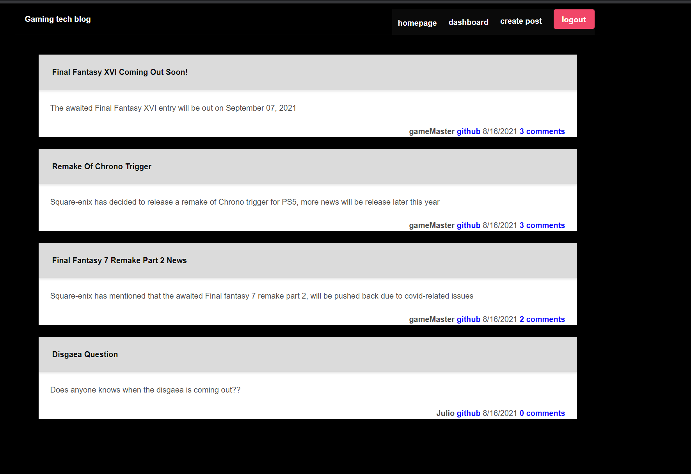

## Gaming Blog
   
### Description

*An application using mysql database, following CMS-style built using (MVC). Uses MySQL2, Express, Sequelize, Bulma, Handlebars and dotenv*

### Application Deployment

### Application Screenshot



### Installation Guidelines

- Add a file named .env to the root of the project in order to connect to the db

```text
DB_NAME='techblog_db'
DB_USER='root'
DB_PW='XXX'
```